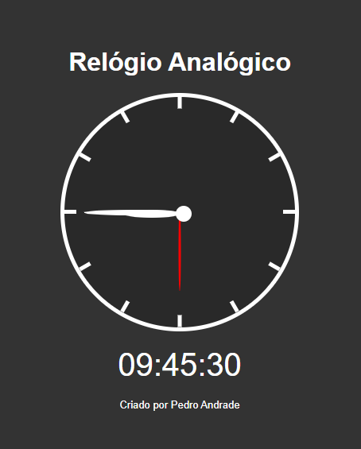

# Relógio Analógico 🕒

Um relógio analógico funcional desenvolvido com HTML, CSS e JavaScript. Ele mostra a hora atual tanto em formato analógico (com ponteiros) quanto digital, atualizando automaticamente a cada segundo.

## 🚀 Tecnologias utilizadas

- **HTML5**
- **CSS3**
- **JavaScript (Vanilla)**

## 📄 Funcionalidades

- Relógio analógico com marcações e ponteiros de hora, minuto e segundo.
- Relógio digital abaixo do relógio analógico.
- Atualização em tempo real.

## 💻 Como usar

1. Clone o repositório:

```bash
git clone https://github.com/seu-usuario/seu-repositorio.git
```

2. Acesse a pasta do projeto:

```bash
cd seu-repositorio
```

3. Abra o arquivo `index.html` em seu navegador:

```bash
# Windows
start index.html

# macOS
open index.html

# Linux
xdg-open index.html
```

## 📸 Preview



## 🧑‍💻 Autor

Criado por [Pedro Andrade](https://github.com/peandrade) ✨
